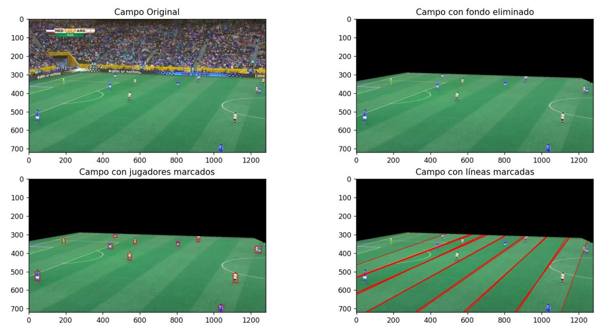

# Soccer Recognition with Computer Vision

This project focuses on recognizing various features within images of a soccer field using computer vision techniques. The key steps involved are as follows:

1. **Field Segmentation:** This step identifies the region of the image corresponding to the soccer field, removing the background and any irrelevant objects outside the field.
2. **Localization of Field Lines:** In this step, the boundary lines of the field are detected, which helps establish the perspective of the image.
3. **Object Identification:** This step involves identifying objects on the field, such as players, referees, and other relevant items.

Several potential solutions to accomplish these tasks are proposed and explained in the corresponding PDF. Below is an example image showing the results obtained from a test image:

Please note that the development of this project was limited to the scope of an academic exercise. As such, the project has not undergone further refinement or optimization beyond this point.
